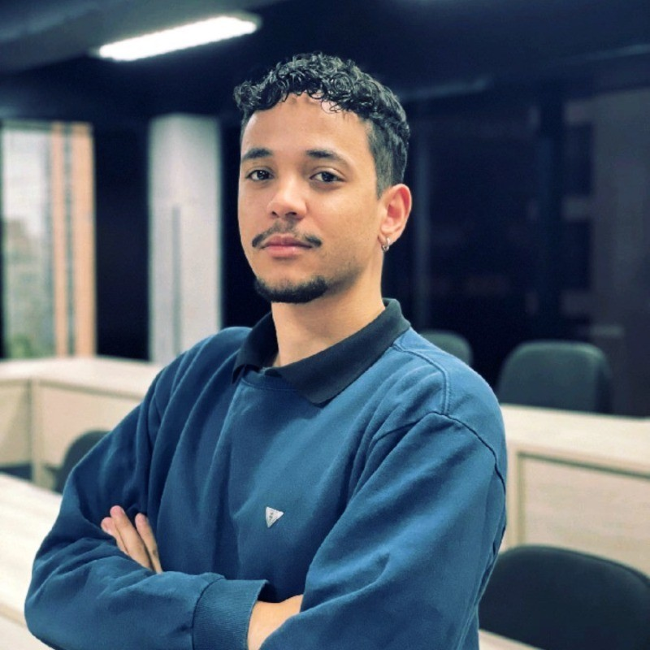

  

## 👨‍💻 Quem sou eu?

Olá! Me chamo **Ricardo de Oliveira Nicolau**, tenho **25 anos** e atualmente curso **Análise e Desenvolvimento de Sistemas** na **São Paulo Tech School**.

No entanto, minha trajetória na tecnologia não começou de forma convencional. Durante dois anos estudei **Odontologia**, mas me sentia incompleto e distante do que realmente me movia. Foi nesse período de autoconhecimento que percebi o quanto **criar**, **inovar** e **resolver problemas** sempre fizeram parte do que eu buscava para vida.

Foi assim que encontrei na **tecnologia** não apenas uma nova carreira, mas um propósito. Desde então, venho me dedicando de corpo e alma a aprender, construir soluções criativas e crescer tanto profissional quanto pessoalmente.

---

## 🎯 Meus objetivos

- 📚 **Desenvolver continuamente** minhas habilidades técnicas e socioemocionais  
- 💼 **Adquirir experiências profissionais** que me desafiem e me façam crescer  
- 🤝 **Contribuir com ambientes colaborativos**, agregando valor por onde eu passar  
- 🚀 **Empreender** com propósito, liderando projetos que impactem positivamente a sociedade  

---

## 🧠 Meus hobbies

- 🏋️ **Prática de esportes**: Academia, futebol e vôlei são parte da minha rotina — acredito que cuidar do corpo é essencial para manter a mente saudável  
- 📖 **Leitura**: Tenho paixão por livros e mangás, que estimulam minha **criatividade**, **visão crítica** e ampliam minha forma de enxergar o mundo  

Essas atividades me ajudam a manter o equilíbrio entre corpo e mente, além de nutrirem minha curiosidade e capacidade de pensar fora da caixa.

